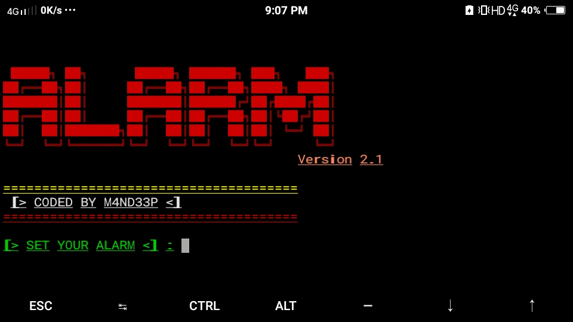

# ALARM
This tool is made for alarm in termux so use this and enjoy ....
By this tool You will be able to set your Alarm According to your time ...Okay so let's See How you can do this ..
------Follow these Few Steps to reach at the destination-----
------[Command]------

1. apt update 
2. apt upgrade
3. pkg install git -y
5. pkg install python2 -y
4. git clone https://github.com/M4ND33P-M4L4K4R/ALARM
5. cd ALARM 
6. chmod +x *
7. ls
8. python2 Alarm.py
--------End of the Command------
You according to your self ...bye bye !!!!
